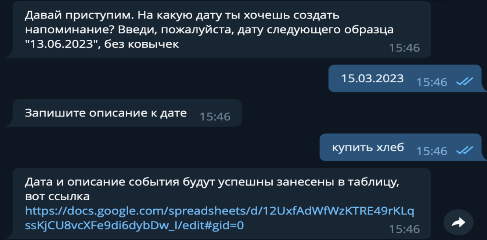
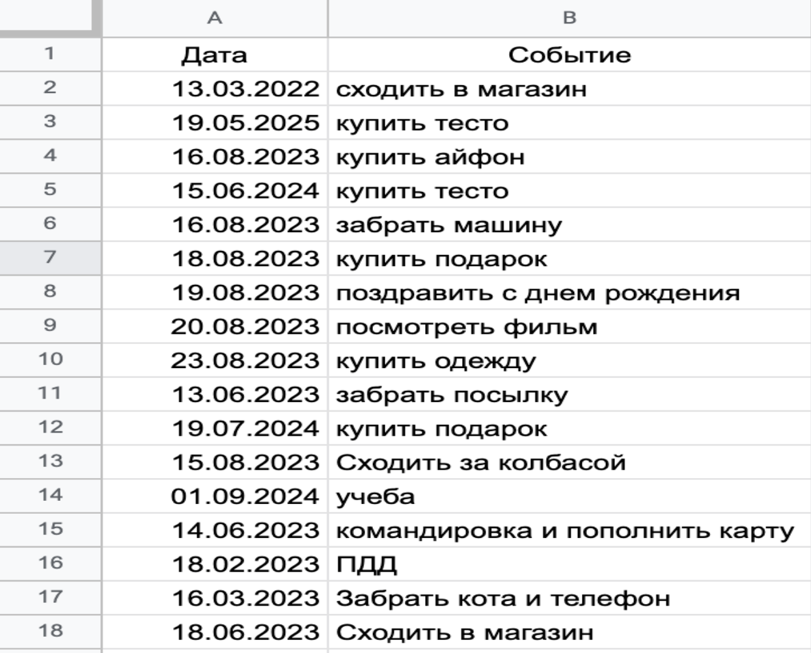

# Добавление напоминания в гугл таблицы через Telegram - бота

## техническое задание

Создать бота, который позволяет пользователям отправлять напоминания в чате с ботом, а затем эти напоминания сохранять в Google таблицу

## Результат работы

Результатом выполненной работы является полностью функциональный телеграм-бот, интегрированный с Google Таблицами. Бот позволяет пользователям добавлять заметки в указанную таблицу, автоматически сохраняя их. Этот бот обеспечивает удобный способ сохранения и организации заметок в реальном времени через мессенджер Telegram.

## Требования
1. Создать аккаунт Google API и получить доступ к API Google Sheets для взаимодействия с таблицами.

2. Настроить Telegram бота:

   - Зарегистрировать бота через BotFather в Telegram.
   - Получить API токен для бота.

3. Разработать функциональность для бота:

   - Принимать и обрабатывать текстовые сообщения от пользователей с напоминаниями.
   - Обеспечить безопасное хранение и доступ к учетным данным Google API.

4. Настроить Google Таблицу:

   - Создать таблицу, в которой будут храниться напоминания.
   - Определить структуру таблицы, например: колонки для заметок, даты и времени.

5. Реализовать механизм аутентификации с Google API, чтобы бот мог получить доступ к таблице.

6. Создать обработчики ошибок и уведомления для обоих API (Telegram и Google Sheets), чтобы предотвратить возможные проблемы с доступом или записью данных.

7. Протестировать бота, удостоверившись, что заметки пользователя успешно сохраняются в Google Таблице.

8. Запустить и развернуть бота на выбранном сервере или хостинге, чтобы он был доступен для использования.

9. Провести финальное тестирование и убедиться в его работоспособности.
